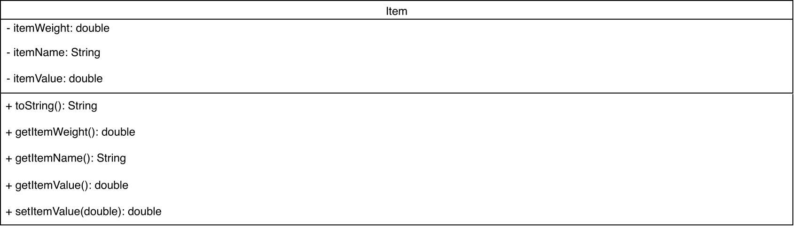
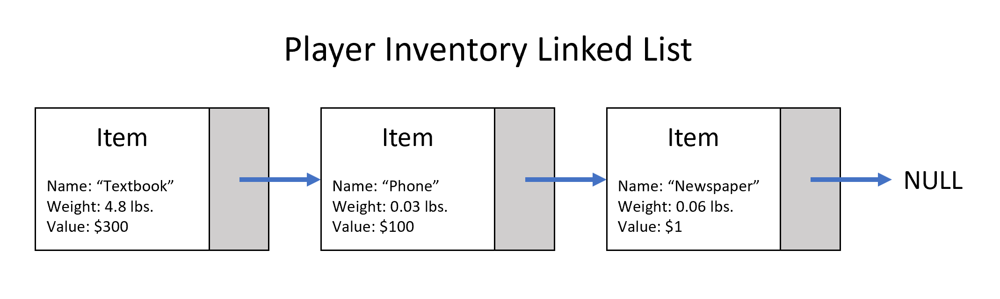
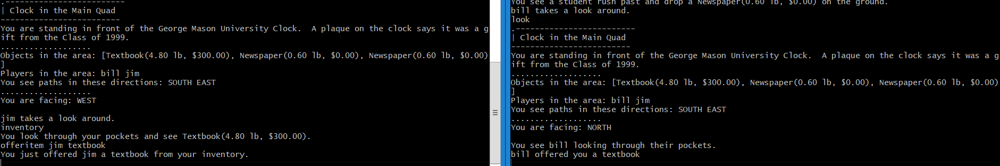
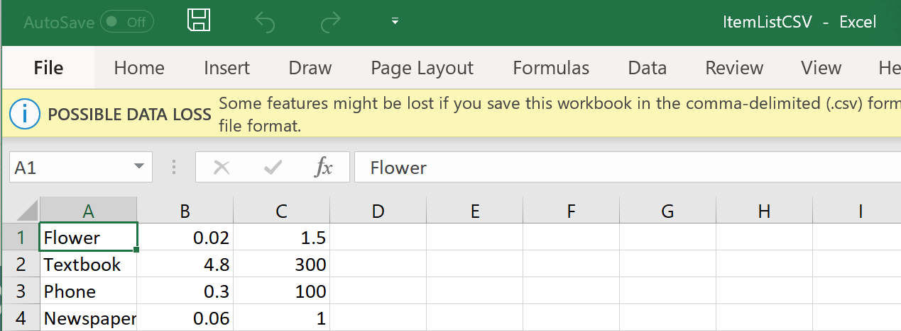
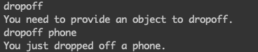

# Items, Player Inventory, Trade

## Table of Contents
1. [Items](#items)
2. [Player Inventory](#player-inventory)
3. [Trading](#trading)
4. [Item Creation](#item-creation)
5. [User Commands](#user-commands)

## Items
Items are within the game and are obtainable for pickup by a player, which are then put into the player's inventory upon doing so. These 
items have the same properties, a name, a weight, and a value, each with unique values. These values are fixed and do not change upon 
initial retrieval of the item, though will later be subject to change over the course of playing. Since the player can only carry so much,
the item weight is there to determine if they can carry anymore than the player's max weight, though a player can only carry 10 items on 
them at a time. Items can also be sold at the shop, as well as traded to other players or even NPCs within the game.

For the technical aspect, an item is a simple class aptly named Item, with corresponding fields for the name (a String), the weight 
(a double), and the value (also a double). It has a constructor which when this class is instatiated, a value for each field must be set.
To go along with this are getter methods to obtain values from elsewhere, but no setters since these values will not change initially.
For reference, below is an image of the class diagram for the Item class:

## Player Inventory
The player’s inventory is currently a list of item objects that the player has acquired through various means. This inventory is limited to only ten items. If a player attempts to pickup any additional items, they will be greeted with a message informing them that they have too many items and are unable to pick up any more. Items can be moved into and out of a player’s inventory by picking them up off the ground, dropping them onto the ground, or through trade.

From a technical perspective, this list of items is implemented using Java’s linked list class. List operations are done using the methods given by this class. However, anyone wishing to manipulate the player's inventory should use the methods given by the Player class.

To add an object to a player's inventory, one must create an item object and pass it to the player's addItemToInventory(Item) method. To remove an object from a player's inventory, one must pass a string containing the item's name to the player's removeObjectFromInventory(String) method. The method will search the list for the first instance of an item with the given name and remove it.

The Room class manages items using the same implementation as the Player class. The only difference between the two implementations being that a Room's list of items is limited to five items instead of ten.

## Trading
Trading is a way to give item objects to other players within the game. The option to trade allows players to share valuable items with their friends. At the moment, players can offer an item to another player. The item in question must be within the player’s inventory and the target of the offer must be a valid player logged into the game.

In order to offer an item to another player, the user command is OFFERITEM. The item and the player must be specified in the console command. Please see the section on user commands for the usage of OFFERITEM.

Within the offerItem method, multiple checks occur on the input. The player offering the item is checked, making sure the request came from a valid source. A similar check is performed on the target player. There is a check on the item in question, confirming that it is in the player’s inventory. A string is always returned to give feedback. This lets the players know why any failed trade did not go through, as well as informs them of a valid offer. In the case that the offer is successful, a message is sent directly to the target player.

Here is an example of a successful offer:

## Item Creation
New Items can be created or destroyed by editing a csv file. The order of the input for every item is the csv file should be in the following order: item's name, followed by the item's weight, followed by the item's value. The ItemParser class is used to interpret the csv file input, and only contains a static method called parse. The parse method accepts a string in its parameter. This string should contain the file path of the csv file. The method then reads in the csv file and extracts each item's information. The parse method creates a new item object for each item in the csv file and stores it in an ArrayList. Once each item is created and stored, the parse method returns the ArrayList of the new items created.
  
The following image depicts the proper order items should be entered in the csv file, along with their proper attributes:

## User Commands
### Dropoff
The dropoff command removes an item from the player inventory and places it in the room inventory. To use this command simply type `DROPOFF <item_name>`. Once the dropoff command is entered, the dropoff function will check that the user provided an item to drop and that the item exists in the player inventory. If these conditions are met, the item will be moved from the user inventory to the room inventory. If the user doesn't specify an item to dropoff or the item provided doesn't exist in the user's inventory, a message will be displayed to notify the user.

### OfferItem
The offerItem command gives the player the ability to offer an item to another player. To use this command simply type `OFFERITEM <item_name> <player_name>`. The offerItem function will check that the user entered an item to offer, as well as a player to offer the item to. If these conditions are satisfied it will check that the item exists in the inventory, otherwise it will display an error message to notify the player. If the item doesn't exist in the inventory an error message will also be displayed.

Below is an example output of the dropoff function. If an item is not provided an error message is displayed. A message is also displayed if the item is been dropoff successfully.

The offerItem function works in a similar way but a player name is also required.

### SortInventory
User inventory can be sorted by three attributes: name, value, or weight.
To sort the inventory just type `SORTINVENTORY <attribute>`. Then type `INVENTORY` to see the items sorted.

### OfferItem
This command allows us to offer items from our inventory to other players. Simply type `OFFERITEM <playerName> <itemToOffer>`.

### OfferResponse
This command is use to reply to an offer from another player. Once a player has offered an item, reply by typing `OFFERRESPONSE <decision>`. Where the decision would be accept or refuse.

### Describe
This command describes items in the inventory. In order to use it type `DESCRIBE <item>`, where item is the item in the inventory you want to describe.

### UseItem
This command allows us to use items in our inventory. By using this command, the item is deleted from inventory and the player gets a 'title' based on the item used for 2 minutes. Just type `USEITEM <item>`, where item is the item in your inventory you want to use.     

## Authors
__Items:__ Christopher French  
__Player Inventory:__ Tiernan O'Rourke  
__Trading:__ Rachel Cousins  
__Item Creation:__ Bryan Ruano Sanchez  
__User Commands:__ Danay Izquierdo Santos  
