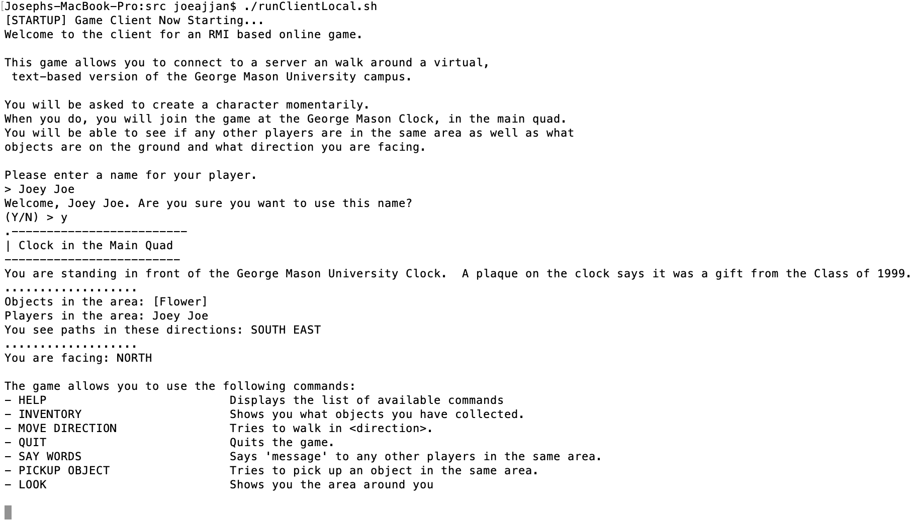
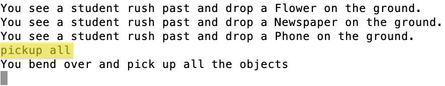
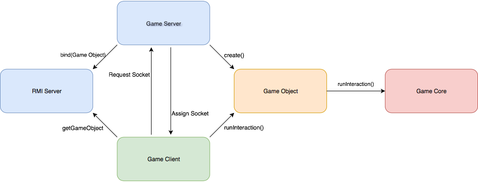
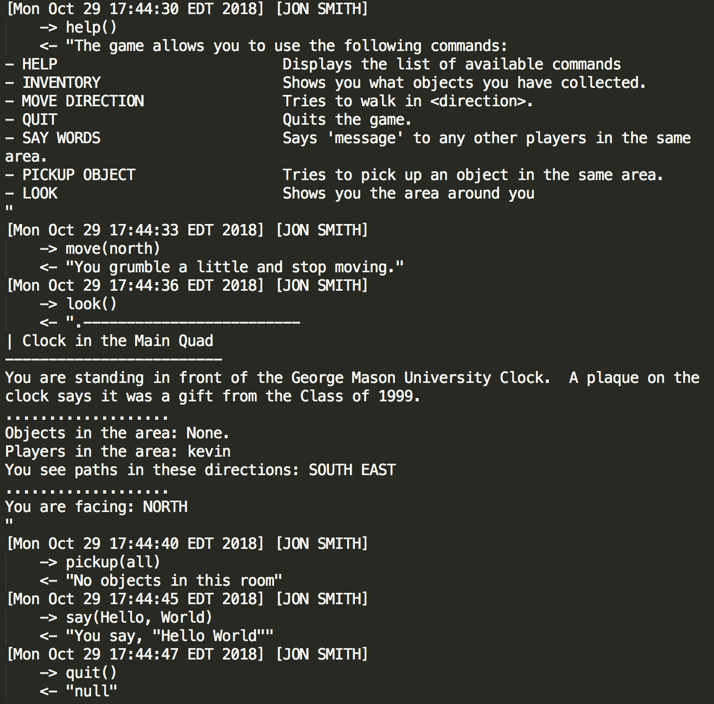

# Player-World Interactions
In this section we discuss:
* How the *User* might make use of the client
* How the *Game* performs interactions with the world
* The way *Client* and *Server* interact

## How to use it

### Interacting with the game (Joseph)

The player has the ability to interact with the game through the use of the user command input interface. When the game starts up, the game prompts the player to enter a name in order to sign in. 

After the player logs-in to the game, a menu with a list of commands will appear on screen.

> 

Each option on the list states the command and a description of what the command performs when the necessary arguments are typed in.

An example of menu-player interaction is when the user types in PICKUP ALL. Typing the command allows the player to pick up all of the items in the current room.

> 

If the player has difficulty in putting in the commands, the player is prompted by the game to type in HELP to allow for the game command menu to be seen again.

### Available commands (Andrew)
Below is a list of the currently available commands as well as their arguments and a brief description of what each command does.

| Command             | Descrption |
| ------------------- | ---------- |
| `LOOK`              | Shows you the area around you. |
| `SAY <MESSAGE>`     | Says the message that you entered to any other players in the same area. |
| `MOVE <DIRECTION>` | Tries to walk in the provided direction. Available directions are North, South, East, and West.
| `PICKUP <OBJECT>` | Tries to pick up an object in the same area. If the entered object is All, it will try to pick up every object in the same area. |
| `INVENTORY` | Shows you what objects you have collected. |
| `QUIT` | Quits the game. |
| `HELP` | Displays the list of available commands. |
| `CHALLENGE <PLAYER>` | Challenges a specified player to a Rock Paper Scissors Battle. |
| `ACCPET <PLAYER>` | Accepts a Rock Paper Scissors Battle Challenge from a specificed Player. |
| `REFUSE <PLAYER>` | Refuses a Rock Paper Scissors Battle Challenge from a specificed Player. |
| `ROCK` | Play Rock in your current Rock Paper Scissors Battle. |
| `PAPER` | Play Paper in your current Rock Paper Scissors Battle. |
| `SCISSORS` | Play Scissors in your current Rock Paper Scissors Battle. |

### Command Aliases (Laura)

There is a `aliases.cvs` file available where you can specify a new name for an existing command so it is easier for you to remember all of them.
Once you fill the gap you would be able to use both names for one command.
The command configuration file has this appearance:

 

The first column of the CVS file, where you have all the existing commands provided by the game, should not be modified. The next column is used to put the equivalent word you want to use as an alias so you can modify it. If you do not want to add an alias to some specific command you can just leave a blank space.

## Notes for developers

### Client-Server command execution (Kevin)
> 

The game works by making use of Java's RMI. Specifically, there's an RMI server running alongside the `GameServer`. Said server is bound to a `GameObject`, which acts as a middleman between *Server* and *Client*.

When a player starts the `GameClient`, this connects to the RMI server to get the *Object* intance and to the *Server* to request a web socket to allow for communication between clients.

The *Client* makes then use of the `GameObject` interface to call interactions from the user to the *world*. The middleman then calls to the `GameCore`, who actually performs the interactions. If there's anything needed to be returned to the *Client*, the *Core* will give it back to the *Object*, and this one to the *Client*. After this, the result will be treated as defined by the processing of the command that is being executed (see [Registering new commands](#Registering-new-commands-Kevin)).

### Commands for interacting (Andrew)

There are quite a few commands available for use inside of the gamecore file. The `run` command is designed to cause random objects to be generated and dropped into random rooms. 

There are two `broadcast` commands: One takes a player as one of the arguments, the other takes a room for it. They will display a message in the room of the player or the room passed as an argument, the difference being whether everyone in the room will see it or whether everyone excluding the passed in player will see it. 

The `log` command is designed to help keep track of all interactions between players and the server being printing the result of every command to a log file specific to each player. This will help with catching errors and debugging. A sample from a logfile can be seen in the picture below.

> 

The `doBattle` command contains the majority of the code for executing the Rock Paper Scissors battles between players. 


### Registering new commands (Kevin)
To register a new command in the game, several steps must be followed.

First, functionality for the command must be implemented. This should usually be done in `GameCore`. However, a middleman invocation should exist in `GameObject` too (as to be able for the `GameClient` to call it.

Once this is done, the command must be registered for the *Client* to be able to recognize it. To do so:

#### 1. Register Preprocessing
Add the command preprocessing. This is done in `setupFunctions()` method in `CommandRunner.java` (this method is around the top of the file). To do so, you need to include a line similar to the following:
```java
commandFunctions.put("", (name, args) -> { <code> } );
```
The purpose of this is to make all the commands have a common way of being called so we can allow `GameClient` to not know anything about the commands. What we do, instead, is parse the input read from console into `command: String` and `args: ArrayList`. Then we call the command with `name: String`, which is the name of the player, and the `args`. After that, each command will do the preprocessing needed (the `<code>` part above).
It might be that your command doesn't need processing, such as LOOK:
```java
commandFunctions.put("LOOK", (name, args) -> remoteGameInterface.look(name));
```
In this case you can just call the method needed from the remoteGameInterface. **BEWARE!** This needs to return a `String`. In the case of **LOOK** it returns whatever the player should get in the console. If your command handles console output getting the player's writer and **doesn't return a string**, then you need to do something like the **ROCK** command and return `null`:
```java
commandFunctions.put("ROCK", (name, args) -> {
    remoteGameInterface.rock(name);
    return null;
});
```
If in fact you need to do any preprocessing, you are gonna end up with something like the **MOVE** command:
```java
commandFunctions.put("MOVE", (name, args) -> {
    try {
        String direction = args.get(0);

        if (direction.equals("")) {
            return "[ERROR] No direction specified";
        } else {
            return remoteGameInterface.move(name, direction);
        }
    } catch (IndexOutOfBoundsException ex) {
        return "[ERROR] No direction specified";
    }
});
```
You can refer to other commands in the `CommandRunner.java` file for more examples.

#### 2. Include a description (Laura)

You need to add a description for the command. You'll need to do so in two places:
* Default `createCommands()` method. Add a line like:
```java
descriptions.put("", new String[]{"", ""});
```
where you include the name of the command, the arguments it takes (if none, an empty string ""; if more than one, separate them by spaces "ARG1 ARG2") and its description.
* You need to add the same info in the `commands.csv` file. 
The configuration file has a line for each command where the first element will be the name of the command, the second column should include the arguments needed to run it and the last one a short description about what it does to ensure the client knows about the functionality of the command, if you do not write a description for the new command, this is not going to be created. In this file, you should add these command specifications separated by commas:
```CSV
LOOK,,Shows you the area around you
SAY,MESSAGE,Says <MESSAGE> to any other players in the same area.
...
<NAME>,<ARGS>,<DESCRIPTION>
```

### Debugging interactions (Joseph)
Whenever a player performs a command in the game, the action is recorded to a log file. The command is recorded to the file through the use of the run() method in CommandRunner.java.

The method looks at the command that was inputted in the game and checks if the command that was entered is valid. 

```java
if (cmd != null) {
    try {
        String result = cmd.run(playerName, args);
        if (result != null)
            System.out.println(result);

        remoteGameInterface.logInteraction(playerName, command, args, result);
    } catch (RemoteException ex) {
        Logger.getLogger(CommandRunner.class.getName()).log(Level.SEVERE, null, ex);
    }
}
```

If the entered command input is valid, the method call, remoteGameInterface.logInteraction(playerName, command, args, result), records the completed command into the log file.

If there is an error during the recording of the command, the error will be caught by a RemoteException and written down in the log file

The log file has a history of all commands that were typed in by the players. The file will allow game developers to keep a log of actions in order to track any bugs or issues that may come up in the game.

