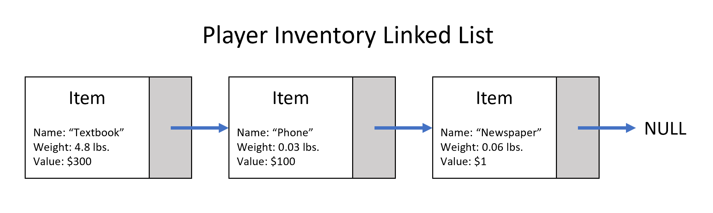

# Items, Player Inventory, Trade

## Player Inventory
The player’s inventory is currently a list of item objects that the player has acquired through various means. This inventory is limited to only ten items. If a player attempts to pickup any additional items, they will be greeted with a message informing them that they have too many items and are unable to pick up any more. Items can be moved into and out of a player’s inventory by picking them up off the ground, dropping them onto the ground, or through trade.

From a technical perspective, this list of items is implemented using Java’s linked list class. All list operations are done using the methods attached to this class. Adding an object to a player’s inventory requires creating an item object and passing it to the player’s addItemToInventory method. In contrast, removing an object involves passing a string containing an item’s name to the player’s removeObjectFromInventory method. The method will then search the list for the first instance of an item with the same name and remove it.  
The Room class manages items using the same implementation as the Player class. The only difference between the two implementations being that the Room’s list of items is limited to five items instead of ten.