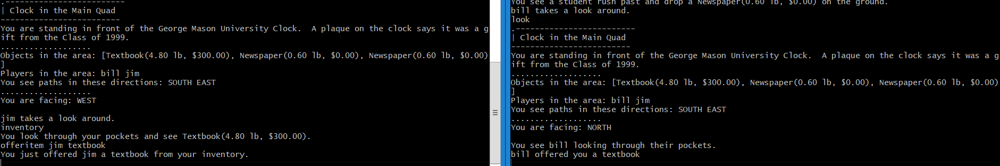

# Items, Player Inventory, Trade

## Trading
Trading is a way to give item objects to other players within the game. The option to trade allows players to share valuable items with their friends. At the moment, players can offer an item to another player. The item in question must be within the player’s inventory and the target of the offer must be a valid player logged into the game.
In order to offer an item to another player, the user command is OFFERITEM. The item and the player must be specified in the console command. Please see the section on user commands for the usage of OFFERITEM.
Within the offerItem method, multiple checks occur on the input. The player offering the item is checked, making sure the request came from a valid source. A similar check is performed on the target player. There is a check on the item in question, confirming that it is in the player’s inventory. A string is always returned to give feedback. This lets the players know why any failed trade did not go through, as well as informs them of a valid offer. In the case that the offer is successful, a message is sent directly to the target player.
Here is an example of a successful offer:

