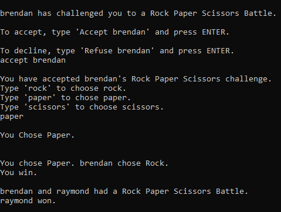
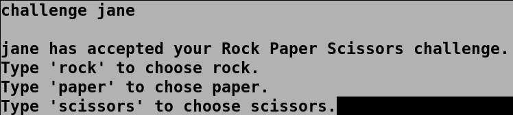
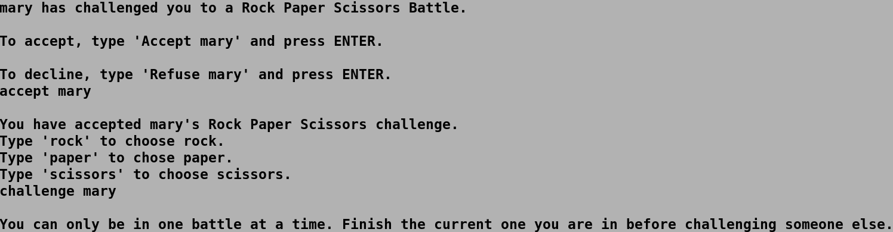
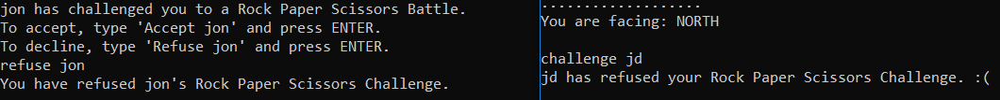
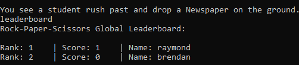
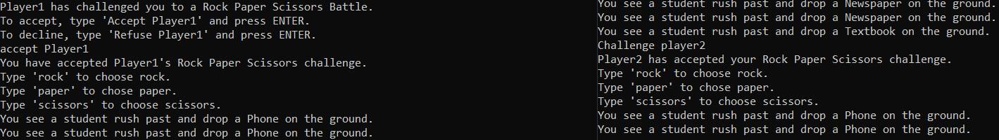
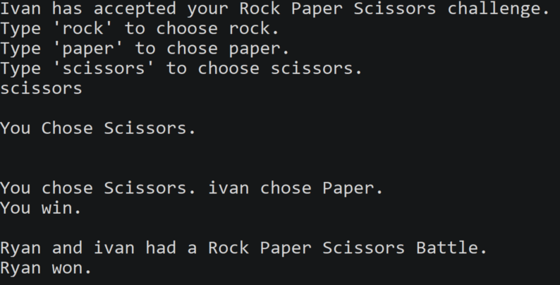
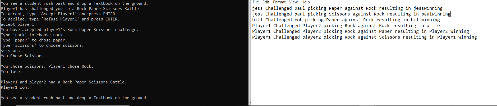

### RPS Battle System
When two players engage in a battle, the Battle object prompts them to choose their attack using the `Rock`, `Paper`, or `Scissors` commands. Once both players have made their selection, the victor is determined through the following logic:

* 	If both the challenger (player 1) and the opponent (player 2) have chosen the same command, the battle ends in a tie.
*	Else, if player 1 chose rock and player 2 chose paper, player 2 wins.
*	Else, if player 1 chose rock and player 2 chose scissors, player 1 wins.
*	Else, if player 1 chose paper and player 2 chose rock, player 1 wins.
*	Else, if player 1 chose paper and player 2 chose scissors, player 2 wins.
*	Else, if player 1 chose scissors and player 2 chose rock, player 2 wins.
*	Else, if player 1 chose scissors and player 2 chose paper, player 1 wins.


__Related Methods:__ Located in `GameCore.java`
```java
public void rock(String player)
public void paper(String player)
public void scissors(String player)
public void doBattle(String challenger, String player2, int p1, int p2, Battle b)
```
        
__Example of a Rock Paper Scissors Battle__



___Author - Brendan Raymond___

___Edited/Formatted by - Ryan Hoang___

---
### Challenge Mechanism
Challenge is a void method that is a part of the Rock Paper Scissors feature. Before any battle can begin this method must be called first. When called, this method takes in two parameters, two strings representing the player initiating the challenge and the player being challenged. 

**Related Methods:** Located in `GameCore.java`
```java
public void challenge(String challenger, String player2)
```

Once the player objects have been initialized, the challenge method checks for any error conditions.

If any error conditions are met within the challenge method, the battle request is cancelled and ignored. 

* You cannot challenge a player that doesn't exist.
* You cannot challenge yourself to a Rock Paper Scissors Battle.
* You can only participate in one Rock Paper Scissors Battle at a time.

If no error conditions are met, the request is added to the list of pending battles. The request will remain in this list until the other player accepts the challenge.

**Command Syntax**

To challenge another player type the following: `Challenge [Player2]`

Substitute `[Player2]` with the name of the player you wish to challenge.

**Example of Challenging Another Player**



**Example of Challenging Another Player While In A Battle**



___Author - An Ly___

___Edited/Formatted by - Ryan Hoang___

---
### Refuse Mechanism
Refuse is a void method that is a part of the Rock Paper Scissors battle feature. This method can be called in response to being challenged by someone else. Refuse has 2 parameters, `challenger` which is a String with the name of the challenger and `player2` which is a String with the name of the player being challenged. Once the players have been initialized, the method checks to see whether challenger really exists.

If challenger doesn’t really exist, the player trying to refuse a challenge will be informed that they cannot refuse a challenge from a player that doesn’t exist. 

If challenger does exist, each pending battle is checked to see whether `challenger` actually challenged `player2`. 

If there is no pending request, `player2` gets informed that there were no pending challenges from `challenger`.

If there was a pending challenge, `player2` refuses the challenge and the system informs both the `challenger` and `player2` that it has been cancelled.

**Related Methods:** Located in `GameCore.java`
```java
public void refuse(String challenger, String player2)
```

**Command Syntax**

To refuse a challenge from another player type: `Refuse [Player]`


**Example of Refusing Another Player's Battle Request**



___Author - Jnanadeep Dandu___

___Edited/Formatted by - Ryan Hoang___

---


### Rock Paper Scissors Tutorial 
Tutorial is a void method that is part of the Rock Paper Scissors battle feature. The tutorial function features an NPC named the Professor that exists to help teach players how to use the commands available to engage in RPS battles. 

Talking to the Professor can occur by calling the tutorial command while in the same room as the Professor. Once called upon, the Professor starts talking to the player that chose to have a tutorial. The Professor gives the player options about what the Professor can teach and the player can choose an option by entering the corresponding number, which results in a scripted response from the Professor. 

The player can continue to choose options to learn about the various RPS commands available until the player wishes to stop talking to the Professor and picks the option to end the tutorial.

**Related Methods:** Located in `GameCore.java`
```java
public String tutorial(String name)
```

**Command Syntax**

To talk to the Professor and get a tutorial, type `tutorial` when in the same room as the Professor.

#### **Screenshot To Be Added Later When Feature Is Fixed**

===========================================

___Author - Jnanadeep Dandu___

___Edited/Formatted by - Ryan Hoang___

---

### Rock Paper Scissors Leaderboard
As players score victories over one another in battle, the game will keep track of their total number of wins, as well as their overall ranking across the server. 

When a player first joins the server, they are assigned a PlayerScore object, which keeps track of the player’s name and total wins. 

This PlayerScore is then added to the global Leaderboard object: the first player has rank 1, the second player has rank 2, etc. The player’s rank is determined by their position on the list, with the ith PlayerScore holding a rank of i. 

Scores are initially set to zero. Each time a player wins a battle, their score is incremented by one point, and its position on the Leaderboard list is incremented above any other scores it surpasses. 

**Related Methods:** Located in `GameCore.java`
```java
public void checkBoard(String name)
```

**Command Syntax**

The complete Leaderboard can be viewed using the `LEADERBOARD` command, with each score listed alongside its rank and player name. 

**Example of the Leaderboard Feature**



___Author - Brendan Raymond___

___Edited/Formatted by - Ryan Hoang___

---

### Accepting Challenges

This feature provides the ability to accept a Rock Paper Scissors challenge when another player sends a request.

When a player is challenged to a Rock Paper Scissors battle, they will be prompted to either `Accept` or `Refuse` the challenge.
 
To accept the challenge, all that is required is that the player types `Accept [Player]`, substituting `[Player]` with the username of the person who sent the request.  
  
When a player types `Accept [Player]` a function called accept is called, taking in two parameters, the name of the challenger and the name of the player being challenged. 
  
A search is done through the list of pending battles and active battles.
* If a player is already in a battle, it will not let them accept a new request. 
* If a player has not been challenged, it will tell them no pending request exists. 
* Otherwise, it will start the battle for both players.

**Related Methods:** Located in `GameCore.java`
```java
public void accept(String challenger, String player2)
```

**Command Syntax**

`Accept [Player]` Substitute `[Player]` with the other player's username.

**Example of the Accept Battle Feature**



___Author - Justin Lacks___

___Edited/Formatted by - Ryan Hoang___

---

### Results of a Rock Paper Scissors Battle 
The PvP Rock Paper Scissors feature allows players to challenge each other to impromptu battles anywhere in the game world. 

Currently, the way this feature works is that one player will challenge another with the following command syntax: `Challenge [opponent]` where `[opponent]` is a string representing another player’s username.
 
During a battle, players can choose one of three options. These options are `Rock`, `Paper`, or `Scissors`. 

The standard rules for Rock Paper Scissors apply. 

* When there is a tie, both players will receive a message along the lines of “Player1 and Player2 had a Rock Paper Scissors Battle, it ended in a tie”. In addition to this, any players in the same room will see that same message broadcasted to them.

* When one player beats another, both players will see a message that says who won and the result will be broadcast to all players in the same room.

**Example of Battle Result Broadcast Feature**



___Author - Ryan Hoang___

---

### Rock Paper Scissors Battle Logfile
The log system keeps a record of all Rock Paper Scissors battles that have happened. Each time a battle is completed, it is written to the log file in the form,

`[Player1] challenged [Player2] picking [Rock] against [Paper] resulting in [Player2] winning`

The log file ensures that all Rock Paper Scissors battles are recorded so that an administrator can view and use for debugging purposes. 

The logging function created for this purpose is called from the battle function. 

Whenever the Rock Paper Scissors code reaches an end condition, i.e. battle is complete, the function `writeLog()` is called to record the results in a log file. The `writeLog()` function accepts the following parameters: the name of player1, the name of player2, player1’s choice, player2’s choice, and the winner of the battle. The function concatenates all the strings given and writes it to the battlelog.txt in the format shown above.

**Related Methods:** Located in `GameCore.java`
```java
public void writeLog(String play1, String play2, String p1, String p2, String winner)
```

**Example of the Battle Log Feature**



___Author - Justin Lacks___

___Edited/Formatted by - Ryan Hoang___

---


