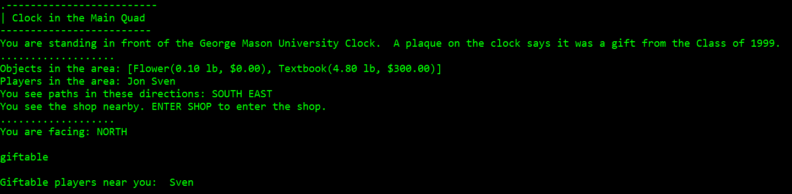
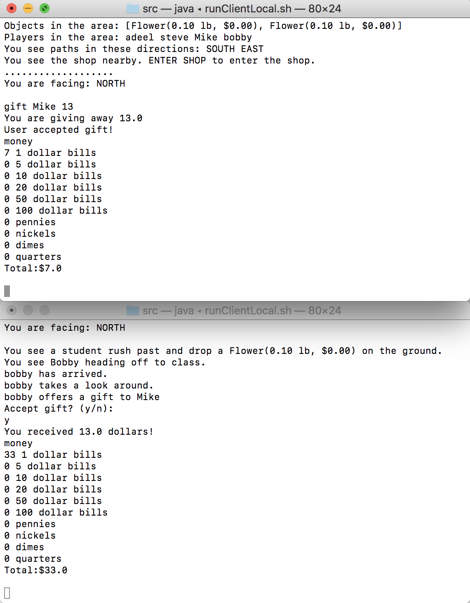
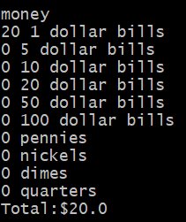
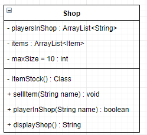

# Shops & Money

##  Giftable Command - Thinh Ly

### For Users:

Players in the game can gift a user selected amount of money to each other. However, gifting can only occur between *two players within in the same room.* Use `giftable` to have the game return you a list of players located in the same room as you. If no names are returned then you are alone in that room.
 

### For Developers:

The method for `giftable` can be found in GameCore.java. The `giftable` method takes in the playerName of the player who called it as a parameter. Using playerName, we can use the method findPlayer() from the PlayerList class to verify the validity of the call. As such, if playerName is null then the method returns null. 
```
Player player = playerList.findPlayer(playerName);
```
Otherwise, if the new player instance is not null, we use the same strategy by making a new instance of the Room class and the findRoom() method from the Maps class to find the current room of the player.
```
Room room = this.map.findRoom(player.getCurrentRoom());
```
We can now easily use the Room class’ getPlayers() method to return a string of player objects within the room. 


## Gift Command - Adeel Mudassar

### For Users:

Gifting is a command that allows users to interact with one another. It allows a user to give money to another user. When the menu comes up the user (giver) can type in “gift” as a command follower by another user’s name (receiver) and an amount. This will then prompt the second user to accept or deny the trade. If they proceed to accept the gift, the money is then transferred from the first user’s account to the second users; and a message is displayed on both of their screens. If the user proceeds to decline the gift than the first user is given a message stating that their gift was denied. 

### For Developers:

When the gift command is called it uses the given parameters and calls the method in gamecore which prompts the receiver to accept or deny the gift. Each user is a player object and has an array of money linked to them. This array is changed by the giveMoney() method in the player class which is run by the gamecore class if the user accepts the gift. GiveMoney has three fields, the giver, receiver, and amount (these were passed on from the gameclient). It takes an amount and runs a while loop (same number as times as the amount) that takes each dollar and puts it in the receiver’s money array, it then prints a message for the receiver stating they have been given money. The giveMoney method then returns a money object that was created using the amount given. 



## Units of money - Tram-Anh Nguyen

### For Users: 
Money in this game mirrors the units of money we have in American dollars and coins (ie: one dollar bills, five dollars bills, quarters, pennies, and so on). Each player will be provided 20 one dollars bills at the start of the game. To see a printout of your player money at any point in the game, type in the command 'money' into your terminal. 



Throughout the game, players can carry out transactions such as giving money to friends, or selling items to the game shop. As of now, there is no bank available in the game, so players cannot exchange dollars or coins for different units of money (ie: a five dollar bill cannot be broken into five one dollar bills). 
### For Developers: 
Money is the parent class of Dollar and Coin. Dollar is the parent class of all dollar units of money. Coin is the parent class of all coin units of money. The hierarchy below illustrates the units of money available in this game: 

 - Money 
	 - Dollar (each Dollar has an associated double value) 
		 - oneDollar
		 - fiveDollar 
		 - tenDollar 
		 - twentyDollar 
		 - fiftyDollar 
		 - hundredDollar
	 - Coin: (each Coin has an associated double value and String name)
		 - Penny
		 - Nickel
		 - Dime
		 - Quarter

Each player has a field called Money money. Money contains two fields- one for an ArrayList\<Dollar\> and one for an ArrayList\<Coin\>. The Money class provides a couple methods: 
- double sum(): returns total amount of money a player owns
- String toString(): returns a line-by-line display of player money with individual units 
	- Note: GameObject.java has a money() method that calls the method viewMoney() of Player.java. viewMoney() calls toString() of the Money class. 

## Shops - Jonathan Touma

### For Users:

There is currently only one shop in the game. This shop is located at the clock tower. If you want to enter the shop, you must be at the clock tower and then simply type “enter shop”. Other players in the shop will be notified of your presence. At the moment, players are unable to buy items from the shop. Players can only sell items to the shop. If you would like to sell items to the shop, type “sell ITEM”. The item will be removed from your inventory and you will be rewarded with money equal to the value of the sold item. The shop also keeps track of the last 10 items sold to it. This means you will be able to buy back items you have sold or items other players have sold (at a 20% markup) once the buy feature is added in.

### For Developers:

Shops are initialized and used when the server begins running in the GameCore class. At the moment, there is only one shop and it is created and referred to in GameCore as a private final class field. More shops can be added by adding more private variables or by creating some sort of data structure to store multiple shops. Shops will keep track of all players who are currently in the shop. This is useful when determining if a player can perform some action (e.g sell). Shops have a nested inner class called ItemStock used only for displaying purposes in Shop.displayShop(). Instead of displaying multiple flowers, it will list flowers with their multiplicities. 

 

