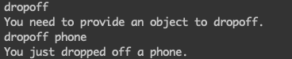

## User Commands

### Dropoff
The dropoff command removes an item from the player inventory and places it in the room inventory. To use this command simply type `droppoff <item_name>`. Once the dropoff command is entered, the dropoff function will check that the user provided an item to drop and that the item exists in the player inventory. If these conditions are met, the item will be moved from the user inventory to the room inventory. If the user doesn't specify an item to dropoff or the item provided doesn't exist in the user's inventory, a message will be displayed to notify the user.

### OfferItem
The offerItem command gives the player the ability to offer an item to another player. To use this command simply type `offerItem <item_name> <player_name>`. The offerItem function will check that the user entered an item to offer, as well as a player to offer the item to. If these conditions are satisfied it will check that the item exists in the inventory, otherwise it will display an error message to notify the player. If the item doesn't exist in the inventory an error message will also be displayed.

Below is an example output of the dropoff function. If an item is not provided an error message is displayed. A message is also displayed if the item is been dropoff successfully.

The offerItem function works in a similar way but a player name is also required.

Both of these functions are called in GameClient.java and implemented in GameCore.java.
The functions signatures are defined in the GameObjectInterface.java. The dropoff takes two strings as parameters: player name and item name. The offerItem function takes three parameters: the name of the player offering the item, the item name, and the name of the target player. 
